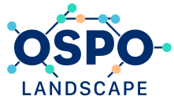
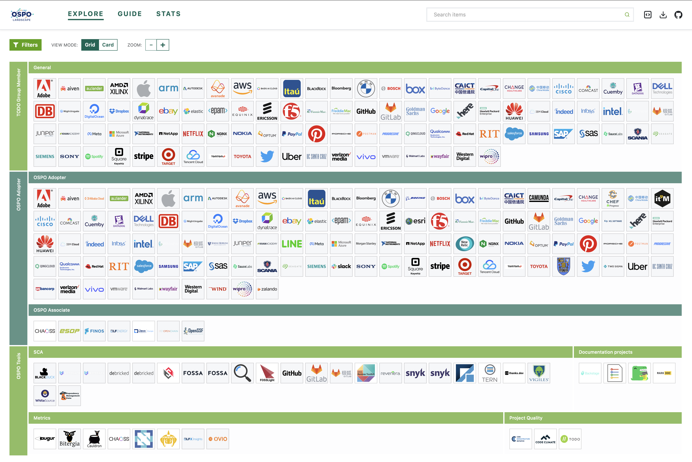

# OSPO Landscape

This landscape is intended as a map to explore the OSPO Ecosystem, and also shows the member companies of the TODO Group. It is modelled after the Cloud Native Computing Foundation (CNCF) [landscape](https://landscape.cncf.io) and based on the same [open source code](https://github.com/cncf/landscape2).

## Current Version

## Interactive Version

Please see [landscape.todogroup.org](https://landscape.todogroup.org).

## New Entries

We welcome contributors who are willing to include new entries of organizations that have an OSPO (Open Source Program Office) or a similar open source initiative in the *OSPO Adopter* category, as well as open source projects that assist OSPOs in the *Tools* category.

> An OSPO does NOT need to be a TODO Member to be in the OSPO Landscape as an OSPO Adopter, every organization with an OSPO (governments, companies, academic institutions) can apply.

To submit a new entry, please take note of the following guidelines:

* Organizations with an OSPO or open source initiative must have a public facing site (e.g., <https://opensource.google>, <https://ospo.ucsc.edu/> or <https://github.com/aiven>)
* Projects must be open source and hosted in a source code management system, like GitLab, GitHub, etc.
* The project or organization needs a logo and the logo needs to include the name.
* We are unlikely to create a new category for projects as we'd rather find the best home with the current options.

If you think your organization or project should be included, please open a pull request to add it to [landscape.yml](landscape.yml). A logo must be added to the `hosted_logos` directory (in SVG format) and referenced from the `logo` field.

## Logos

The following rules will produce the most readable and attractive logos:

1. We require SVGs, as they are smaller, display correctly at any scale, and work on all modern browsers.
2. When multiple variants exist, use stacked (not horizontal) logos. For example, we use the second column (stacked), not the first (horizontal), of CNCF project [logos](https://github.com/cncf/artwork/#cncf-incubating-logos).
3. Don't use reversed logos (i.e., with a non-white, non-transparent background color).
4. Logos must include the company, product or project name in English. It's fine to also include words from another language.
5. Match the item name to the English words in the logos. So an Acme Rocket logo that shows "Rocket" should have product name "Rocket", while if the logo shows "Acme Rocket", the product name should be "Acme Rocket". Otherwise, logos looks out of place when you sort alphabetically.
6. Google images is often the best way to find a good version of the logo (but ensure it's the up-to-date version). Search for [grpc logo filetype:svg](https://www.google.com/search?q=grpc+logo&tbs=ift:svg,imgo:1&tbm=isch) but substitute your project or product name for grpc.

### Proper SVGs

SVGs need to not rely on external fonts so that they will render correctly in any web browser, whether or not the correct fonts are installed. If you have the original AI file, here are the steps in Illustrator to create a proper SVG:

1. Open file in Illustrator
1. Select all text
1. With the text selected, go to Object > Expand in the top menu
1. Export file by going to File > Export > Export As in top menu
1. Select SVG from the format drop down and make sure that "Use Artboards" is checked
1. This will open a SVG options box, make sure to set Decimal to 5 (that is the highest possible, so to ensure that sufficient detail is preserved)
1. Click Okay to export

## Corrections

Please open a pull request with edits to [landscape.yml](landscape.yml).

## License

This repository contains data received from [Crunchbase](http://www.crunchbase.com). This data is not licensed pursuant to the Apache License. It is subject to Crunchbase’s Data Access Terms, available at [https://data.crunchbase.com/v3.1/docs/terms](https://data.crunchbase.com/v3.1/docs/terms), and is only permitted to be used with this Landscape Project which is hosted by the Linux Foundation.

Everything else is under the Apache License, Version 2.0, except for project and product logos, which are generally copyrighted by the company that created them, and are simply cached here for reliability. The trail map, static landscape, serverless landscape, and [landscape.yml](landscape.yml) file are alternatively available under the [Creative Commons Attribution 4.0 license](https://creativecommons.org/licenses/by/4.0/).
